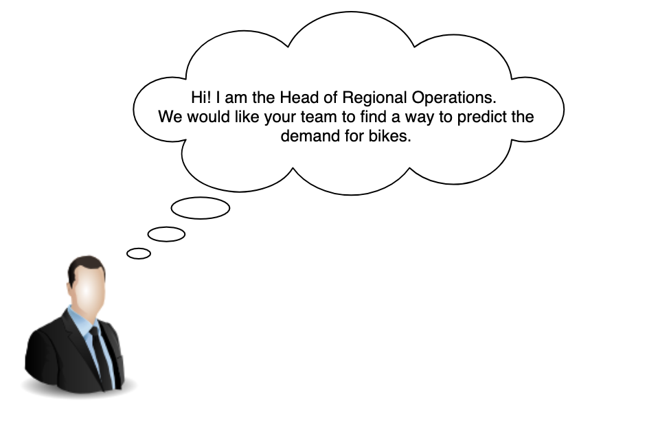

# Forecasting Demand for Bike Sharing


We will tinker with a bike-sharing dataset as a way to:

1. Share a simplified version of a typical process of developing a Machine Learning solution
2. Share some of the techniques, algorithms, technologies involved
3. Share key things to keep in mind when developing a Machine Learning solution



We will follow this 8 step process to take our bike-sharing Machine Learning model from proof-of-concept to production:

1. Frame the problem and look at the big picture.
2. Get the data.
3. Explore the data to gain insights.
4. Prepare the data to better expose the underlying data patterns to Machine Learning
algorithms.
5. Explore many different models and short-list the best ones.
6. Fine-tune your models and combine them into a great solution.
7. Build an API using Flask and Swagger
8. Launch, monitor, and maintain your system using Docker and Kubernetes

- For EDA take a look at `src/ Bike Sharing EDA.ipynb`
- For feature engineering and model development take a look at `src/Feature Engineering & odel Development.ipynb`
- For a simple Flask+Swagger API script take a look at `api/prediction_api.py`


`docker build -t bike .`

```
heroku create kewpyp
heroku container:push web --app bike-pred
heroku container:release web --app bike-pred
```